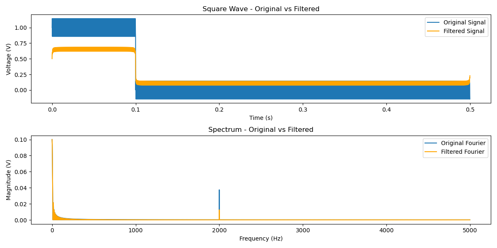

## Prerequisites
To optimize the Fourier transform performance, this script uses C++. You'll need to install `pybind11` first:

```bash
pip install pybind11
```

If you're using Debian, you can install it with:

```bash
sudo apt install python3-pybind11
```

Additionally, ensure you have `numpy` and `matplotlib` installed. You can install them using:

```bash
pip install numpy matplotlib
```

## Build
1. **Build the module:**
   ```bash
   python setup.py build_ext --inplace
   ```

2. **Run the script:**
   ```bash
   python script.py
   ```

3. **Enjoy the results!**


